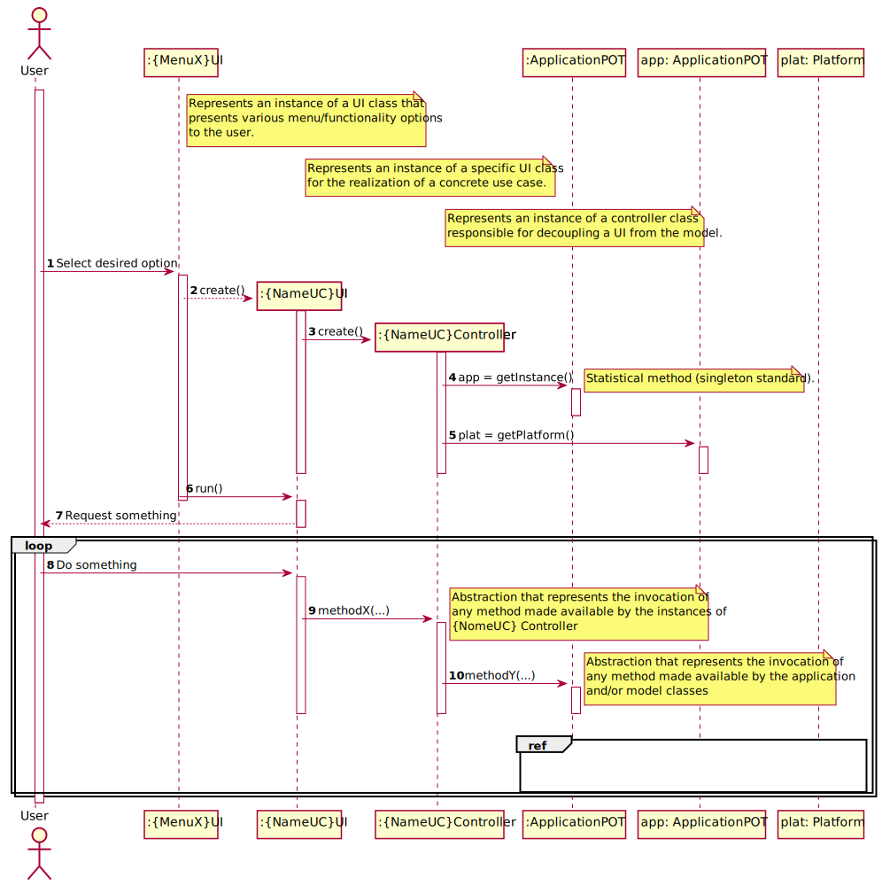

# README #

1º: After running the project, enter as adm@lapr.pt with the password 123456.
2º: Create as many Organizations as you like in the Administrator window.
3º: Go to E-mails.txt in the File file.
4º: Enter with the mail and password assigned in the mail.
5º: Experience all the possibilities of our work.

This repository contains didactic artifacts related to the project developed in the Curricular Unit (UC) of Software Engineering (ESOFT) 2019-2020 edition of [Degree in Computer Engineering (LEI)](http://www.isep.ipp.pt/Course/Course/26) do [Higher Engineering Institute of Porto (ISEP)](http://www.isep.ipp.pt).

In particular, it contains:

* [Project description](docs/README.md)
* Proposed resolution for the activities of Requirements Engineering, Analysis and Design OO
* Source code made available to students as a starting point
* Description of the general functioning of the application provided

### General Application Operation

The following sequence diagram graphically represents the intended flow for the application where there is a clear separation (decoupling) between the domain classes and the user interaction classes (_user interface_). This decoupling is performed by classes with the suffix _Controller_.

In this UC it is intended that students concentrate essentially on the construction of domain classes (cf. documentation).
 

