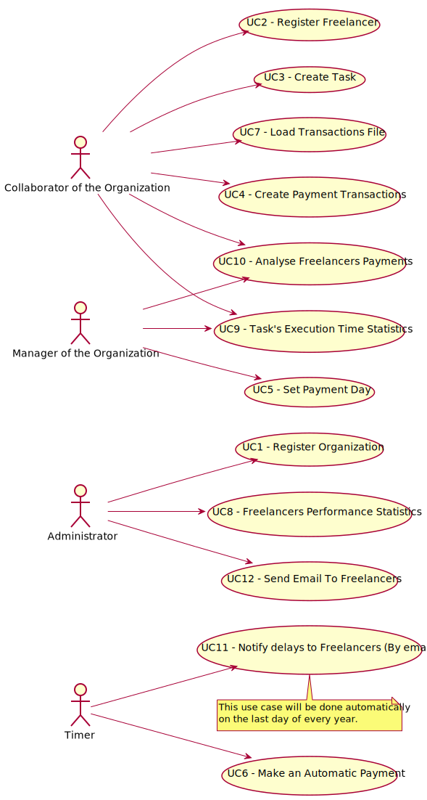

# Use cases Diagram

**For each use case, must be done its description (requirements engineering perspective) and its realization (design perspective) must be carried out.**

# Use Cases
| UC  | Description                                                                          |                       
|:----|:-------------------------------------------------------------------------------------|
| UC1 | [Register Organization](../UC1/UC1_RegisterOrganization.md)                          |
| UC2 | [Register Freelancer](../UC2/UC2_RegisterFreelancer.md)                              |
| UC3 | [Create Task](../UC3/UC3_CreateTask.md)                                              |
| UC4 | [Create Payment Transactions](../UC4/UC4_CreatePaymentTransactions.md)               |
| UC5 | [Set Payment Day](../UC5/UC5_SetPaymentDay.md)                                       |
| UC6 | [Make an Automatic Payment](../UC6/UC6_MakeAutomaticPayment.md)                      |
| UC7 | [Load Transactions File](../UC7/UC7_LoadTransactionsFile.md)                         |
| UC8 | [Freelancers Performance Statistics](../UC8/UC8_FreelancersPerformanceStatistics.md) |
| UC9 | [Analyse Task's Execution Time Statistics](../UC9/UC9_TaskExecutionTimeStatistics.md)|
| UC10| [Analyse Freelancer Payments](../UC10/UC10_AnalyseFreelancerPayments.md)             |
| UC11| [Notify Freelancers Delays](../UC11/UC11_NotifyDelaysFreelancers.md)                 |
| UC12| [Send Email To Freelancers](../UC12/UC12_SendEmailToFreelancers.md)                  |
