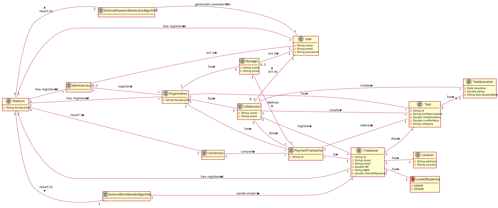

# OO Analysis #
The domain model construction process is based on use cases, in particular the nouns used, and the description of the statement.

## Rational for identifying domain classes ##
For the identification of domain classes, the list of categories of TP classes (suggested in the book) is used. As a result we have the following table of concepts (or classes, but not software) by category.

### _List of Categories_ ###

**Transactions (of the business)**

*  PaymentTransaction

---

**Transaction lines**

*  LevelOfExpertise
---

**Transaction-related products or services**

*  Task
*  TaskExecution

---

**Records (of transactions)**

---  

**People's roles**

* Administrator
* Freelancer
* Collaborator (of the Organization)
* Manager (of the Organization)
* User

---

**Places**

*  Location
*  Platform
---

**Events**

*  Send Email
*  Automatic Payment
---

**Physical objects**

---

**Specifications and descriptions**

*  Task
*  TaskExecution
*  PaymentTransaction
---

**Catalogs**

---

**Sets**

* LevelOfExpertise

---

**Set Elements**

* Freelancer's Expertise Level

---

**Organizations**

*  T4J (Plataform)
*  Organization

---

**Other (external) systems**

*  (User Management Component)
*  ExternalEmailSenderAlgorithm
*  ExternalPasswordGeneratorAlgorithm
*  Conversion
---

**Records (financial), work, contracts, legal documents**

*  PaymentTransaction

---

**Financial instruments**

* Conversion

---

**Referred documents / to perform the tasks /**

---

## **Rational about identifying associations between classes** ##

An association is a relationship between instances of objects that indicates a relevant connection and is worth remembering, or is derivable from the List of Common Associations:

+ A is physically (or logically) part of B
+ A is physically (or logically) contained in B
+ A is a description of B
+ A is known / captured / recorded by B
+ A uses or manages B
+ A is related to a B transaction
+ etc.

| Concept (A) 		                   |  Association          |  Concept (B)                       |
|-----------:	 		                   |:-------------:	     	 |------------:                       |
| Platform                           | has registered      	 | Organization                       |
|                                    | has registered        | Freelancer                         |
|           	                       | has registered        | User                               |
|                                    | has registered        | Administrator                      |
|           	                       | resort to             | ExternalEmailSenderAlgorithm       |
|           	                       | resort to             | ExternalPasswordGeneratorAlgorithm |
|                                    | resort to             | Conversion                         |
| Organization                       | has                   | Collaborator                       |
|                                    | has                   | Manager                            |
|                                    | has                   | Task                               |
|                                    | has                   | PaymentTransaction                 |
| ExternalEmailSenderAlgorithm       | sends email to        | Freelancer                         |
| ExternalPasswordGeneratorAlgorithm | generates password to | User                               |
| Collaborator                       | act as                | User                               |
|                                    | registers             | Freelancer                         |
|                                    | does                  | PaymentTransaction                 |
|                                    | introduces            | Task                               |
|                                    | creates               | TaskExecution                      |
| Manager                            | act as                | User                               |
|                                    | defines               | PaymentTransaction                 |
| PaymentTransaction                 | to                    | Freelancer                         |
|                                    | referent              | Task                               |
| Freelancer                         | has                   | LevelOfExpertise                   |
|                                    | has                   | Location                           |
|                                    | does                  | Task                               |
| Administrator                      | act as                | User                               |
|                                    | registers             | Organization                       |
| Task                               | has                   | TaskExecution                      |
| Conversion                         | converts              | PaymentTransaction                 |

## Domain Model

** Note: the types of data considered basic / primitive (eg String, Double, Integer, Boolean) presented are merely indicative and optional. ** It should also be noted that these types of data do not represent or intend to represent any concept of business. Otherwise, they should be represented as such, i.e. through a concept (i.e. conceptual class).

### Summary

A Domain Model represents a partial and approximate view of the problem / business at hand.

This was intended to demonstrate once again that there is not only one correct Domain Model.
Others may exist and be acceptable.
Nor was it intended to be exhaustive in the possible alternatives and, therefore, there may still be other acceptable alternatives.

The important thing is that it captures (without fail) the main concepts and associations between concepts.

It should also be noted that the UML notation for associative classes was introduced.
