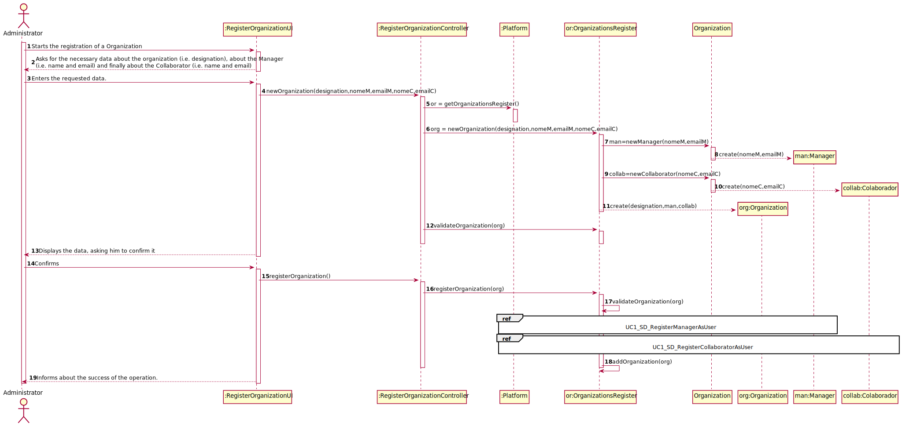
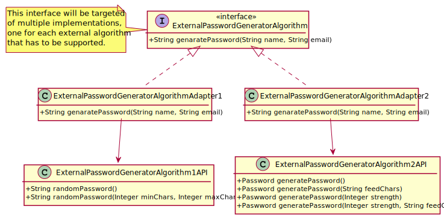

# UC1 - Register Organization

## 1. Requirements Engineering

### Brief Format

The Administrator **starts** the registration of a Organization. The system **asks** for the necessary data about the organization (i.e. designation), about the Manager (i.e. name and email) and finally about the Collaborator (i.e. name and email). The Administrator **enters** the requested data. The system **validates** and **displays** the data, asking him to confirm it. The Administrator **confirms**. The system **records** the data of the Organization, its Manager and the Collaborator, making these users registered, and **sends** their passwords (generated by the system) by email and **informs** the Administrator about the success of the operation.

### SSD

### Full Format

#### Main actor

* Administrator

#### Stakeholders and their Interests

* **Administrator:** intends to register an organization so that it can take advantage of the functionality provided by the platform.
* **T4J:** wants an organization to be registered in order to use the platform.

#### Pre-conditions

* N/A

#### Post-conditions

* The Organization's, Manager's and Collaborator's information is saved in the system.
* A user is created on the platform for the Manager and other for the Collaborator.
* An email is sent to the Manager and other for the Collaborator with information to access the platform.

#### Main success scenario (or basic flow)

1. The Administrator **starts** the registration of a Organization.
2. The system **asks** for the necessary data about the organization (i.e. designation), about the Manager (i.e. name and email) and finally about the Collaborator (i.e. name and email).
3. The Administrator **enters** the requested data.
4. The system **validates** and **displays** the data, asking him to confirm it.
5. The Administrator **confirms**.
6. The system **records** the data of the Organization, its Manager and the Collaborator, making these users registered, and **sends** their passwords (generated by the system) by email and **informs** the Administrator about the success of the operation.

#### Extensions (or alternative flows)

*a. The Administrator requests the cancellation of the registration.

> The use case ends.

4a. Missing minimum required data.
 >	1. The system informs the Administrator which data is missing.
 >	2. The system allows the Administrator to enter the missing data (step 3)
 >
	 >	2a. The Administrator doesn't change the data. The use case ends.

4b. The system detects that the data (email) entered must be unique and that it already exists in the system.
 >	1. The system alerts the Administrator to the fact.
 >	2. The system allows the Administrator to change it (step 3)
 >
	 >	2a. The Administrator doesn't change the data. The use case ends.

4c. The system detects that the data entered (or some subset of the data) is invalid.
  > 1. The system alerts the Administrator to the fact.
  > 2. The system allows you to change it (step 3).
  >
   > 2a. The Administrator doesn't change the data. The use case ends.

#### Special requirements

* The Manager's and Collaborator's password is generated by an external algorithm.

#### List of Technologies and Data Variations
\-

#### Frequency of Occurrence
\-

#### Unanswered Questions

* How often does this use case occur?

## 2. OO Analysis

### Excerpt from the Relevant Domain Model for UC

## 3. Design - Use Case Realization

### Rational

|    Main Flow     | Question: Which Class ...  |   Answer  | Justification  |
|:----------------|:------------------------- |:----------|:---------------------------- |
|1. The Administrator **starts** the registration of a Organization.|... interacts with the Administrator?| RegisterOrganizationUI |Pure Fabrication|
| |... coordinates the UC?  | RegisterOrganizationController |Controller|
| |... creates instances of Organization? | OrganizationsRegister | By the application of the Creator (Rule 1) it would be the "Platform". But, by applying HC + LC to the "Platform", this delegates that responsibility to the "OrganizationsRegister".|
|2. The system **asks** for the necessary data about the organization (i.e. designation), about the Manager (i.e. name and email) and finally about the Collaborator (i.e. name and email).||||
|3. The Administrator **enters** the requested data. |... saves the data entered? | Organization, Manager, Collaborator |IE: Instance created in step 1 |
| |... creates instances of Manager?     |Organization    |Creator (Rule 1)|
| |... creates instances of Collaborator?|Organization    | Creator (Rule 1)|
|4. The system **validates** and **displays** the data, asking him to confirm it. |... validates Organization's data? (local validation) | Organization | IE: Has its own data |
| |... validates Manager's data? (local validation)       | Manager               | IE: Has its own data |
| |... validates Collaborator's data?                     | Collaborator          | IE: Has its own data |
| |... validates Organization's data? (global validation) | OrganizationsRegister | IE: The OrganizationsRegister has registered Organization |
|5. The Administrator **confirms**. ||||
|6. The system **records** the data of the Organization, its Manager and the Collaborator, making these users registered, and **sends** their passwords (generated by the system) by email and **informs** the Administrator about the success of the operation. |... saves the Organization created?| OrganizationsRegister |IE: By applying HC + LC to the Platform |
| |... generates the password   | ExternalPasswordGeneratorAlgorithm | Protected Variation|
| |... register/saves the user regarding the Manager of Organization and the Collaborator of Organization?|FacadeAuthorization|IE: User management is the responsibility of the respective external component whose point of interaction is through the class "FacadeAuthorization"|
| |...sends the Manager's email and Collaborator's email |OrganizationsRegister|IE: Has the necessary information.|

### Systematization ##

It follows from the rational that the conceptual classes promoted to software classes are:

 * Platform
 * Organization
 * Manager
 * Collaborator
 * ExternalPasswordGeneratorAlgorithm

Other software classes (i.e. Pure Fabrication) identified:

 * RegisterOrganizationUI  
 * RegisterOrganizationController
 * FacadeAuthorization (of the user management component)
 * OrganizationsRegister

###	Sequence Diagram

### Sequence Diagram References

###	Class Diagram

---

