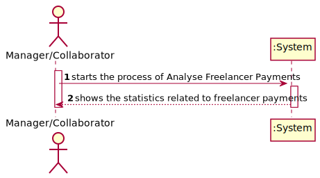

# UC10 - Analyse Freelancer Payments

## 1. Requirements Engineering

### Brief Format

The Manager/Collaborator starts the process of Analyse Freelancer Payments. The system shows the statistics related to freelancer payments.

### SSD

### Full Format

#### Main actors

* Manager
* Collaborator

#### Stakeholders and their Interests

* **Manager:** wants to use the application to see freelancer payments (the mean and the standard deviation of the payments made to each one of the freelancers).
* **Collaborator:** wants to use the application to see freelancer payments (the mean and the standard deviation of the payments made to each one of the freelancers).
* **T4J:** intends that, at any time, both the manager and the collaborator of the organization can use the application to see freelancer payments statistics (the mean and the standard deviation of the payments made to each one of the freelancers).

#### Preconditions

* The user needs to be registered as Manager or Collaborator.

* There must be at least one payment defined in the system.

#### Post conditions

\-

#### Main success scenario (or basic flow)

1. The Manager/Collaborator starts the process of Analyse Freelancer Payments.
2. The system shows the statistics related to freelancer payments.
3. If the Manager/Collaborator wants to sort the freelancers, he selects the type of sorting he wants.
4. The system shows the freelancers sorted according to the selected option.

#### Extensions (or alternative flows)

*a. The Manager/Collaborator requests the cancellation of the analysis.

> The use case ends.

3a. The Manager/Collaborator doesn´t want to sort the freelancers.

> The use case ends.

#### Special requirements
\-

#### List of Technologies and Data Variations
\-

#### Frequency of Occurrence

\-

#### Unanswered Questions

* How often does this use case occurs?

## 2. OO Analysis

### Excerpt from the Relevant Domain Model for UC

## 3. Design - Use Case Realization

### Rational

|    Main Flow     | Question: Which Class ...  |   Answer  | Justification  |
|:----------------|:------------------------- |:----------|:---------------------------- |
|1. The Manager/Collaborator starts the process of Analyse Freelancer Payments.|... interacts with the Manager/Collaborator?| AnalyseFreelancerPaymentsUI |Pure Fabrication|
| |... coordinates the UC?  | AnalyseFreelancerPaymentsController |Controller|
|| ... knows the user using the system? | UserSession | IE: cf. user management component documentation.
|| ... knows which organization the user belongs to? | OrganizationsRegister | IE: knows all organizations. |
||| Organization | IE: knows his managers/collaborators. |
||| Collaborator | IE: knows his data (e.g. email). |
||| Manager | IE: knows his data (e.g. email). |
|2. The system shows the statistics related to freelancer payments.|...knows the freelancers who received payment from the organization? |Organization| IE: The class Organization has a method that returns a list of the freelancers who received payment from the organization |
|||PaymentTransactionList|IE: PaymentTransactionList has PaymentTransaction (By the application of HC+LC)|
|||PaymentTransaction|IE: in the MD, PaymentTransaction is related to Freelancer |
||...knows the transactions?|Organization|IE: in the MD, the Organization has PaymentTransaction |
|||PaymentTransactionList|IE: in the MD, the Organization has PaymentTransaction. By the application of HC+LC, Organization delegates responsability over PaymentTransactionList.|
|3. If the Manager/Collaborator wants to sort the freelancers, he selects the type of sorting he wants.||||
|4. The system shows the freelancers sorted according to the selected option.||||

### Systematization ##

It follows from the rational that the conceptual classes promoted to software classes are:

 * Plataform
 * Organization
 * PaymentTransaction

Other software classes (i.e. Pure Fabrication) identified:

 * AnalyseFreelancerPaymentsUI
 * AnalyseFreelancerPaymentsController
 * PaymentTransactionList
 * OrganizationsRegister

Other classes of external systems / components:

 * UserSession

###	Sequence Diagram

##### SD_getFreelancersPaymentsStatisticsDoneByOrg

##### SD_calculateMeanP

##### SD_calculateDeviationP

###	Class Diagram

