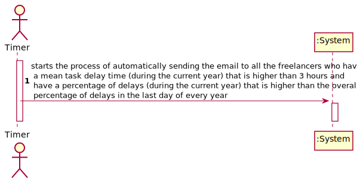
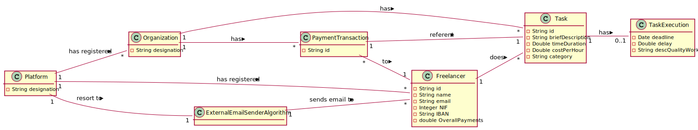
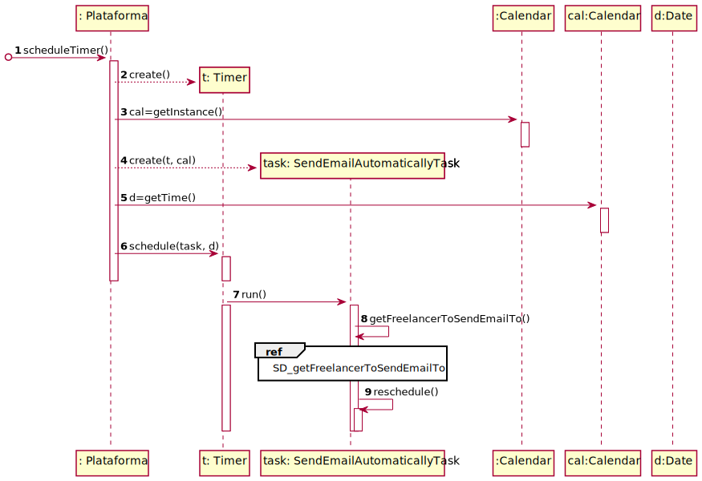
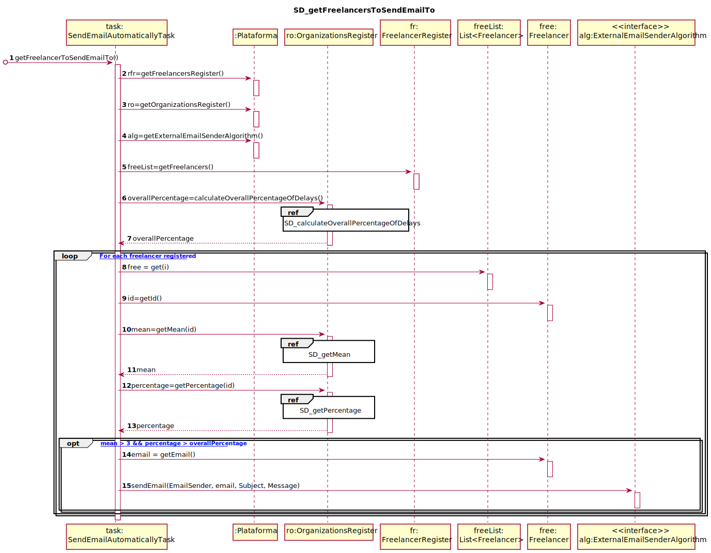
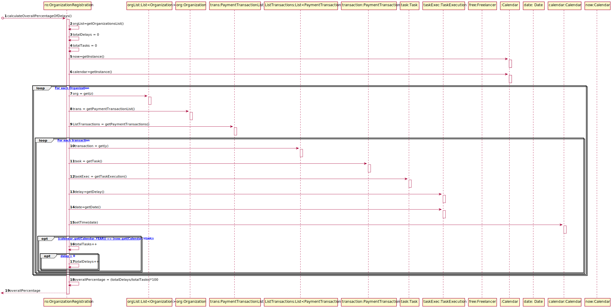
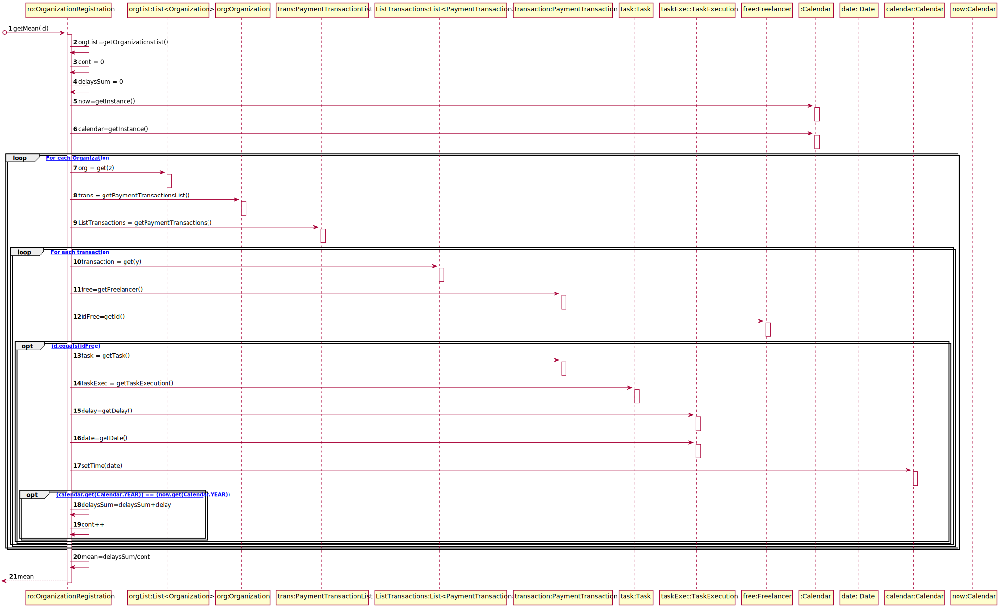
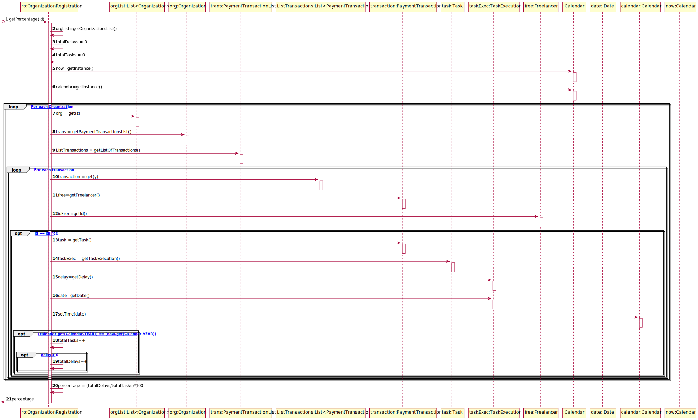
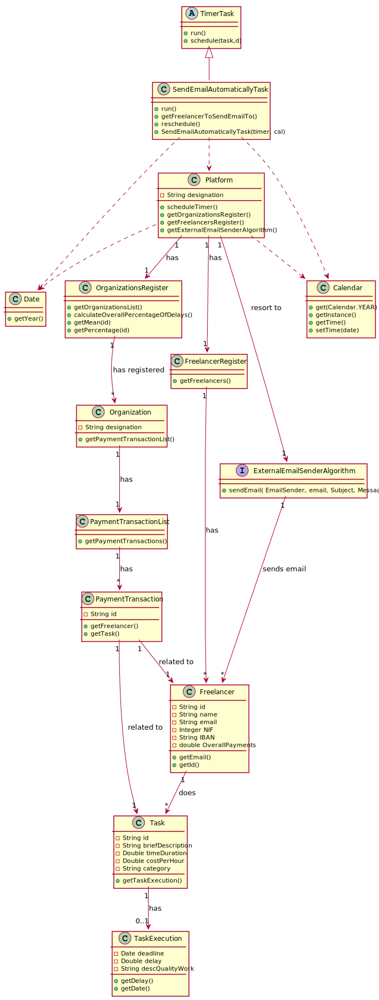

# UC11 - Notify delays to Freelancers (By email)

## 1. Requirements Engineering

### Brief Format

The Timer starts the process of automatically sending the email to all the freelancers who have a mean task delay time (during the current year) that is higher than 3 hours and have a percentage of delays (during the current year) that is higher than the overall percentage of delays in the last day of every year. The system sends the emails.

### SSD

### Full Format

#### Main actor

* Timer

#### Stakeholders and their Interests

* **Freelancer:** expects to receive an e-mail if he have a mean task delay time (during the current year) that is higher than 3 hours and have a percentage of delays (during the current year) that is higher than the overall percentage of delays.
* **T4J:** intends the system to automatically send an e-mail to all the freelancers who have a mean task delay time (during the current year) that is higher than 3 hours and have a percentage of delays (during the current year) that is higher than the overall percentage of delays.

#### Preconditions

* The user needs to be registered as Manager or Collaborator.

#### Post conditions

* All the emails have been sent to all the freelancers who have a mean task delay time (during the current year) that is higher than 3 hours and have a percentage of delays (during the current year) that is higher than the overall percentage of delays.

#### Main success scenario (or basic flow)

1. The Timer starts the process of automatically sending the email to all the freelancers who have a mean task delay time (during the current year) that is higher than 3 hours and have a percentage of delays (during the current year) that is higher than the overall percentage of delays.
2. The system sends the emails.

#### Extensions (or alternative flows)

2a. There aren´t freelancers with the specified parameters (there aren´t freelancers to receive an email).

> The use case ends.

#### Special requirements
\-

#### List of Technologies and Data Variations
\-

#### Frequency of Occurrence

* Once per year (in the last day of every year)

#### Unanswered Questions

* Should the process of sending emails starts at 00:00 AM of the last day of the year or other hour?

## 2. OO Analysis

### Excerpt from the Relevant Domain Model for UC

## 3. Design - Use Case Realization

### Rational

|    Main Flow     | Question: Which Class ...  |   Answer  | Justification  |
|:--------------  |:---------------------- |:----------|:---------------------------- |
|1. The Timer starts the process of automatically sending the email to all the freelancers who have a mean task delay time (during the current year) that is higher than 3 hours and have a percentage of delays (during the current year) that is higher than the overall percentage of delays.|...coordinates the UC?|SendEmailAutomaticallyTask|Pure Fabrication|
|| ...interacts with the timer?| Platform | IE:The platform creates Timer instance. |
||...creates instance of SendEmailAutomaticallyTask?|Platform|Creator(Rule 1)|
|2. The system sends the emails.|...knows the freelancers?|Platform| IE: in the MD, the Platform has registered freelancers. |
|||FreelancersRegister|IE: in the MD, the platform has registered freelancers. By the application of HC+LC Platform delegates responsability to FreelancersRegister|
|||PaymentTransaction|IE: In the MD PaymentTransaction is related to Freelancer.|
||...knows the delays?|TaskExecution|IE: has his own data.|
|||knows the TaskExecution?|IE: in the MD, the Task has TaskExecution|
||...knows the transactions?|PaymentTransactionList|IE : In the MD the Organization has Transaction. By the application of the HC+LC standards it delegates to PaymentTransactionList.|
||...knows the PaymentTransactionList?|Organization|IE : In the MD the Organization has Transaction.|
||...knows the Organization?|OrganizationsRegister|IE : In the MD the Plataformm has Organization. By the application of the HC+LC standards it delegates to OrganizationsRegister. |
||...knows the OrganizationsRegister?|Platform|IE : In the MD the Platform has Organization.|
||...determines which freelancers should receive email?|SendEmailAutomaticallyTask|IE: This class determines the freelancers who have a mean task delay time (during the current year) that is higher than 3 hours and have a percentage of delays (during the current year) that is higher than the overall percentage of delays|
||...sends the email? | ExternalEmailSenderAlgorithm | Protected Variation |

### Systematization ##

It follows from the rational that the conceptual classes promoted to software classes are:

 * Plataform
 * PaymentTransaction
 * Organization
 * Task
 * TaskExecution

Other software classes (i.e. Pure Fabrication) identified:

 * SendEmailAutomaticallyTask
 * FreelancersRegister
 * PaymentTransactionList
 * OrganizationsRegister

 Other classes of external systems / components:

  * ExternalEmailSenderAlgorithm

###	Sequence Diagram

##### SD_getFreelancerToSendEmailTo

##### SD_calculateOverallPercentageOfDelays

##### SD_getMean

##### SD_getPercentage

###	Class Diagram

