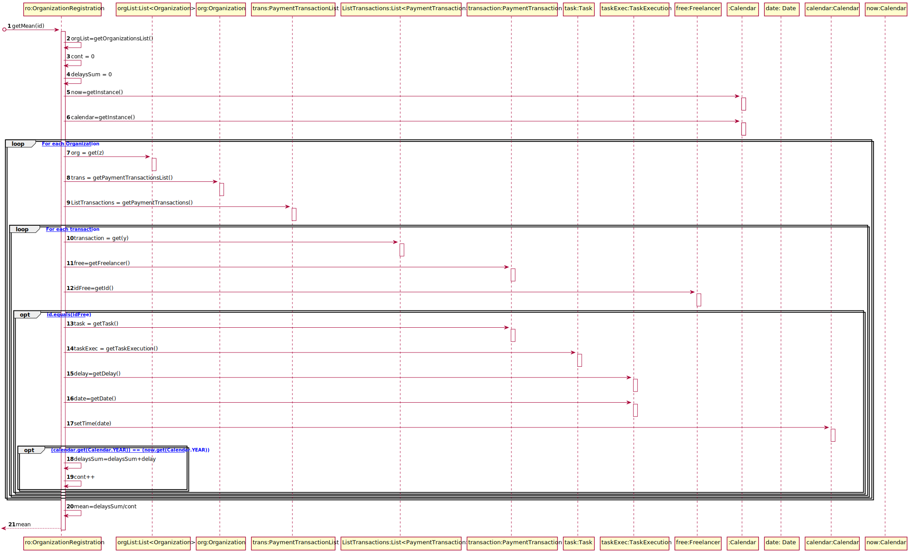

# UC12 - Send Email to Freelancers

## 1. Requirements Engineering

### Brief Format

The Administrator starts the process of sending the email to all the freelancers who have a mean task delay time (during the current year) that is higher than 3 hours and have a percentage of delays (during the current year) that is higher than the overall percentage of delays. The system sends the emails and informs the administrator about the success of the operation.

### SSD

### Full Format

#### Main actor

* Administrator

#### Stakeholders and their Interests

* **Administrator:** wants to send, whenever he wants, an e-mail to all the freelancers who have a mean task delay time (during the current year) that is higher than 3 hours and have a percentage of delays (during the current year) that is higher than the overall percentage of delays.
* **Freelancer:** expects to receive an e-mail if he have a mean task delay time (during the current year) that is higher than 3 hours and have a percentage of delays (during the current year) that is higher than the overall percentage of delays.
* **T4J:** intends the Administrator to send an e-mail to all the freelancers who have a mean task delay time (during the current year) that is higher than 3 hours and have a percentage of delays (during the current year) that is higher than the overall percentage of delays.

#### Preconditions

* The user needs to be registered as Administrator.

#### Post conditions

* All the emails have been sent to all the freelancers who have a mean task delay time (during the current year) that is higher than 3 hours and have a percentage of delays (during the current year) that is higher than the overall percentage of delays.

#### Main success scenario (or basic flow)

1. The Administrator starts the process of sending the email to all the freelancers who have a mean task delay time (during the current year) that is higher than 3 hours and have a percentage of delays (during the current year) that is higher than the overall percentage of delays.
2. The system sends the emails and informs the administrator about the success of the operation.

#### Extensions (or alternative flows)

2a. There aren´t freelancers with the specified parameters (there aren´t freelancers to receive an email).

> An alert is displayed to notify the user about the fact.

#### Special requirements
\-

#### List of Technologies and Data Variations
\-

#### Frequency of Occurrence

\-

#### Unanswered Questions

* How often does this use case occurs?

## 2. OO Analysis

### Excerpt from the Relevant Domain Model for UC

## 3. Design - Use Case Realization

### Rational

|    Main Flow     | Question: Which Class ...  |   Answer  | Justification  |
|:--------------  |:---------------------- |:----------|:---------------------------- |
|1. The Administrator starts the process of sending the email to all the freelancers who have a mean task delay time (during the current year) that is higher than 3 hours and have a percentage of delays (during the current year) that is higher than the overall percentage of delays.|...interacts with the user?|MenuAdministratorUI|Pure Fabrication|
||...coordinates the UC?|SendEmailAutomaticallyTask|Pure Fabrication|
||...creates instance of SendEmailAutomaticallyTask?|MenuAdministratorUI|Creator(Rule 1)|
|2. The system sends the emails and informs the administrator about the success of the operation.|...determines which freelancers should receive email?|...knows the freelancers?|Platform| IE: in the MD, the Platform has registered freelancers. |
|||FreelancersRegister|IE: in the MD, the platform has registered freelancers. By the application of HC+LC Platform delegates responsability to FreelancerRegister|
|||PaymentTransaction|IE: In the MD PaymentTransaction is related to Freelancer.|
||...knows the delays?|TaskExecution|IE: has his own data.|
|||knows the TaskExecution?|IE: in the MD, the Task has TaskExecution|
||...knows the transactions?|PaymentTransactionList|IE : In the MD the Organization has Transaction. By the application of the HC+LC standards it delegates to PaymentTransactionList.|
||...knows the PaymentTransactionList?|Organization|IE : In the MD the Organization has Transaction.|
||...knows the Organization?|OrganizationsRegister|IE : In the MD the Plataform has Organization. By the application of the HC+LC standards it delegates to OrganizationsRegister. |
||...knows the OrganizationsRegister?|Platform|IE : In the MD the Platform has Organization.|
||...determines which freelancers should receive email?|SendEmailAutomaticallyTask|IE: This class determines the freelancers who have a mean task delay time (during the current year) that is higher than 3 hours and have a percentage of delays (during the current year) that is higher than the overall percentage of delays|
||...sends the emails? | ExternalEmailSenderAlgorithm | Protected Variation |

### Systematization ##

* Plataform
* PaymentTransaction
* Organization
* Task
* TaskExecution

Other software classes (i.e. Pure Fabrication) identified:

* SendEmailAutomaticallyTask
* MenuAdministratorUI
* FreelancersRegister
* PaymentTransactionsList
* OrganizationsRegister

Other classes of external systems / components:

 * ExternalEmailSenderAlgorithm

###	Sequence Diagram

##### SD_getFreelancerToSendEmailTo

##### SD_calculateOverallPercentageOfDelays

##### SD_getMean

##### SD_getPercentage

###	Class Diagram

