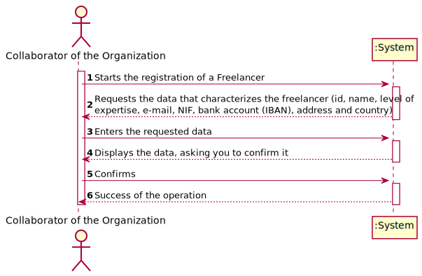
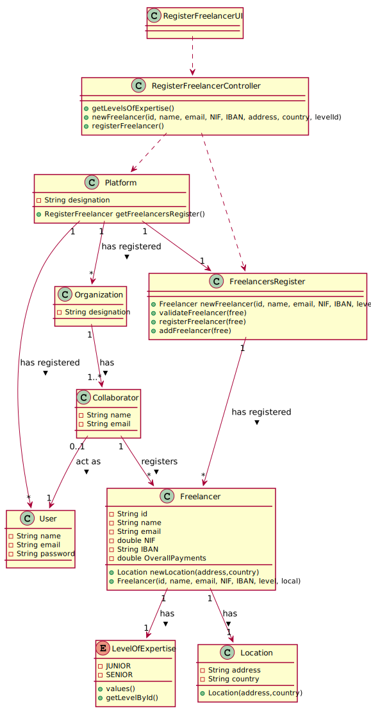

# UC2 - Register Freelancer

## 1. Requirements Engineering

### Brief Format

The Collaborator of the Organization **starts** the registration of a Freelancer. The system **requests** the data that characterizes the freelancer (id, name, level of expertise, e­mail, NIF, bank account (IBAN), address and country). The Collaborator of the Organization **enters** the requested data. The system **validates** and **displays** the data, asking him to confirm it. The Collaborator of the Organization **confirms**. The system **registers** the freelancer's data and **informs** the Collaborator of the Organization about the success of the operation.

### SSD

### Full Format

#### Main actor

* Collaborator of the Organization

#### Stakeholders and their Interests

* **Collaborator of the Organization:** intends to register a Freelancer in the system so that he can perform his tasks.
* **Freelancer:** receives money for the task assigned to him.
* **T4J:** allows the Collaborator of the Organization to make payments to Freelancers.

#### Pre-conditions

* The user is registered as Collaborator of the Organization.

#### Post-conditions

* The Freelancer registration information is saved in the system.

#### Main success scenario (or basic flow)

1. The Collaborator of the Organization **starts** registering a freelancer.
2. The system **requests** the data that characterizes the freelancer (id, name, e­mail, NIF, bank account (IBAN), address and country).
3. The Collaborator of the Organization **enters** the requested data.
4. The system **displays** a list with  levels of expertise and asks the Collaborator of the Organization to **select** one.
5. The Collaborator of the Organization **selects** one.
6. The system **validates** and **displays** the data, asking him to confirm it.
7. The Collaborator of the Organization **confirms**.
8. The system **registers** the freelancer's data and **informs** the Collaborator of the Organization about the success of the operation.

#### Extensions (or alternative flows)

*a. The Collaborator of the Organization requests the cancellation of the registration.

> The use case ends.

6a. Missing minimum required data.
 >	1. The system informs the Collaborator of the Organization which data is missing.
 >	2. The system allows the Collaborator of the Organization to enter the missing data (step 3)
 >
	 >	2a. The Collaborator of the Organization doesn't change the data. The use case ends.

6b. The system detects that the data (id,email,NIF and IBAN) entered must be unique and that it already exists in the system.
 >	1. The system alerts the Collaborator of the Organization to the fact.
 >	2. The system allows the Collaborator of the Organization to change it (step 3)
 >
	 >	2a. The Collaborator of the Organization doesn't change the data. The use case ends.

6c. The system detects that the data entered (or some subset of the data) is invalid.
  > 1. The system alerts the Collaborator of the Organization to the fact.
  > 2. The system allows you to change it (step 3).
  >
   > 2a. The Collaborator of the Organization doesn't change the data. The use case ends.

#### Special requirements
\-

#### List of Technologies and Data Variations
\-

#### Frequency of Occurrence
\-

#### Unanswered Questions

* How often does this use case occur?
* Is all data mandatory?
* Should the id be generated or entered by the Collaborator of the Organization?

## 2. OO Analysis

### Excerpt from the Relevant Domain Model for UC

## 3. Design - Use Case Realization

### Rational

|    Main Flow     | Question: Which Class ...  |   Answer  | Justification  |
|:----------------|:------------------------- |:----------|:---------------------------- |
|1. The Collaborator of the Organization **starts** registering a freelancer. |... interacts with the Collaborator of the Organization?| RegisterFreelancerUI | Pure Fabrication: it is not justified to assign this responsibility to any existing class in the Domain Model. |
| |... coordinates the UC?                                                                     | RegisterFreelancerController |Controller|
| |... creates instances of Freelancer?                                                        | FreelancersRegister           |Creator (Rule 1) combined with HC + LC on Platform.|
|2. The system **requests** the data that characterizes the freelancer (id, name, e­mail, NIF, bank account (IBAN), address and country).||||
|3. The Collaborator of the Organization **enters** the requested data.       |... saves the data entered?                             |Freelancer, Location   | IE: Instance created in step 1|
| |... creates instances of Location?                                                          |Freelancer                    |Creator (Rule 1)|
|4. The system **displays** a list with  levels of expertise and asks the Collaborator of the Organization to **select** one.|... knows the list of levels of expertise?| LevelOfExpertise | IE: LevelOfExpertise has all levels of expertise (Class with a enum).|
|5. The Collaborator of the Organization **selects** one. |...saves the selected level of expertise?| Freelancer | IE: has its own data - in MD the Freelancer has a level of expertise.|
|6. The system **validates** and **displays** the data, asking him to confirm it.|... validates Freelancer's data? (local validation)| Freelancer |IE: Has its own data|
| | ... validates Freelancer's data? (global validation)                                         | FreelancersRegister            | IE: FreelancersRegister has registered Freelancers
|7. The Collaborator of the Organization **confirms**.||||
|8. The system **registers** the freelancer's data and **informs** the Collaborator of the Organization about the success of the operation. |... saves the Freelancer created?| FreelancersRegister | IE: By applying HC + LC to the Platform |

### Systematization ##

It follows from the rational that the conceptual classes promoted to software classes are:

 * Plataform
 * Freelancer
 * Location
 * LevelOfExpertise

Other software classes (i.e. Pure Fabrication) identified:

 * RegisterFreelancerUI  
 * RegisterFreelancerController
 * FreelancersRegister

###	Sequence Diagram

###	Class Diagram

