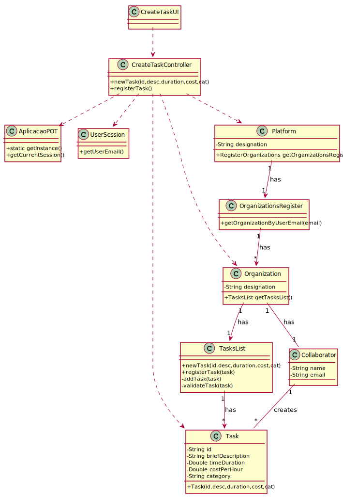

# UC3 - Create Task

## 1. Requirements Engineering

### Brief Format

The Collaborator of the Organization **starts** the process of creating a Task. The system **asks** for the necessary data (i.e. id,
brief description, time duration (in hours), cost per hour (in euros) and task category). The Collaborator of the Organization **enters** the requested data. The system **validates** and **displays** the data, asking him to confirm it. The Collaborator of the Organization **confirms**. The system **registers** the data and **informs** the Collaborator of the Organization about the success of the operation.

### SSD

### Full Format

#### Main actor

* Collaborator of the Organization

#### Stakeholders and their Interests

* **Collaborator of the Organization:** wants to specify tasks.
* **Organization:** wants its Collaborators of the Organization to creates tasks
* **Freelancer:** intends to perform the tasks.
* **T4J:** intends to award tasks to freelancers.

#### Pre-conditions

* N/A

#### Post-conditions

* The information for the new task is recorded in the system.

#### Main success scenario (or basic flow)

1. The Collaborator of the Organization **starts** the process of creating a Task.
2. The system **asks** for the necessary data (i.e. id, brief description, time duration (in hours), cost per hour (in euros) and task category).
3. The Collaborator of the Organization **enters** the requested data.
4. The system **validates** and **displays** the data, asking him to confirm it.
5. The Collaborator of the Organization **confirms**.
6. The system **registers** the data and **informs** the Collaborator of the Organization about the success of the operation.

#### Extensions (or alternative flows)

*a. The Collaborator of the Organization requests the cancellation of the registration.

> The use case ends.

4a. Missing minimum required data.
 >	1. The system informs the Collaborator of the Organization which data is missing.
 >	2. The system allows the Collaborator of the Organization to enter the missing data (step 3)
 >
	 >	2a. The Collaborator of the Organization doesn't change the data. The use case ends.

4b. The system detects that the data (id) entered must be unique and that it already exists in the system.
 >	1. The system alerts the Collaborator of the Organization to the fact.
 >	2. The system allows the Collaborator of the Organization to change it (step 3)
 >
	 >	2a. The Collaborator of the Organization doesn't change the data. The use case ends.

4c. The system detects that the data entered (or some subset of the data) is invalid.
  > 1. The system alerts the Collaborator of the Organization to the fact.
  > 2. The system allows you to change it (step 3).
  >
   > 2a. The Collaborator of the Organization doesn't change the data. The use case ends.

#### Special requirements

- The estimated duration of a task is indicated in hours.
- The cost is indicated in euros per hour.

#### List of Technologies and Data Variations
\-

#### Frequency of Occurrence
\-

#### Unanswered Questions

* Is all data mandatory?
* How often does this use case occur?
* What data together can detect the duplication of Tasks?

## 2. OO Analysis

### Excerpt from the Relevant Domain Model for UC

## 3. Design - Use Case Realization

### Rational

|    Main Flow     | Question: Which Class ...  |   Answer  | Justification  |
|:----------------|:------------------------- |:----------|:---------------------------- |
| 1. The Collaborator of the Organization **starts** the process of creating a Task.  |	... interacts with the Collaborator of the Organization? | CreateTaskUI |  Pure Fabrication: it is not justified to assign this responsibility to any existing class in the Domain Model. |
|  		 |	... coordinates the UC?	| CreateTaskController | Controller  |
|  		 |	... creates instances of Task? | TasksList | Creator (Rule 1) + HC/LC: in the MD the Organization has Task. By HC / LC delegates these responsibilities in TasksList.  |
| |... knows the user / Collaborator of the Organization that are using the system?              | UserSession                 | IE: cf. documentation of the user management component.
| |... knows which organization the user / Collaborator of the Organization belongs to? | OrganizationsRegister        | IE: Knows all organizations.
| |                                                                                           | Organization                 | IE: Knows your Collaborators.
| |                                                                                           | Collaborator                 | IE: Knows your data (e.g. email).
| 2. The system **asks** for the necessary data (i.e. id, brief description, time duration (in hours), cost per hour (in euros) and task category).|||
| 3. The Collaborator of the Organization **enters** the requested data.  		 |	... saves the data entered?   |  Task | Information Expert (IE)-instance created in step 1: it has its own data.  |
| 4. The system **validates** and **displays** the data, asking him to confirm it.  		 |
| 5. The Collaborator of the Organization **confirms**. |	... validates Task's data? (local validation) | Task | IE: Has its own data|  	
|	 |	... validates Task's data? (global validation)   | TasksList  | IE: The TasksList contains / aggregates Task.  |
| 6. The system **registers** the data and **informs** the Collaborator of the Organization about the success of the operation. |	... saves the Task created? | TasksList  | IE: The TasksList contains / aggregates Task. | 		 

### Systematization ##

It follows from the rational that the conceptual classes promoted to software classes are:

 * Platform
 * Organization
 * Collaborator
 * Task

Outras classes de software (i.e. Pure Fabrication) identificadas:  

 * CreateTaskUI  
 * CreateTaskController
 * TasksList
 * OrganizationsRegister

 Other classes of external systems / components:

 * UserSession

###	Sequence Diagram

###	Class Diagram

