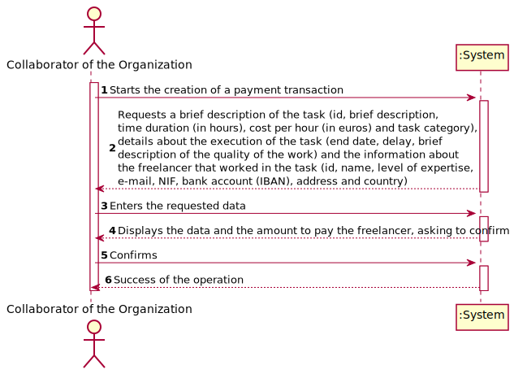
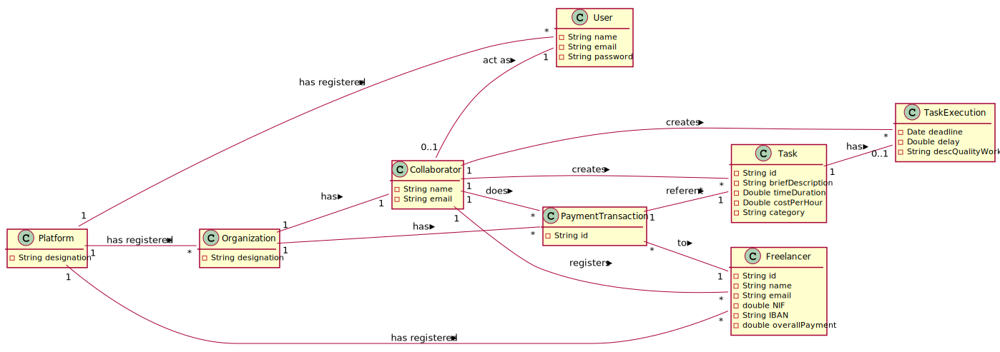
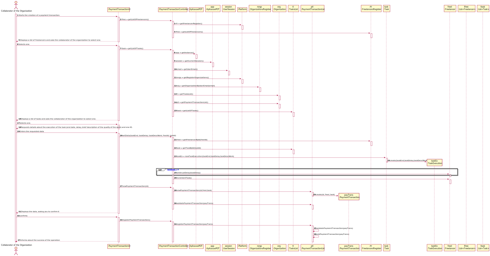
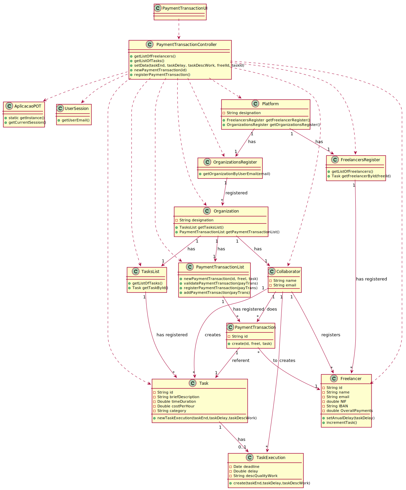

# UC4 - Create Payment Transactions

## 1. Requirements Engineering

### Brief Format

The collaborator of the organization **starts** the creation of a payment transaction. The system **requests** a brief description of the task (id, brief description, time duration (in hours), cost per hour (in euros) and task category), details about the execution of the task (end date, delay, brief description of the quality of the work) and the information about the freelancer that worked in the task (id, name, level of expertise, e­mail, NIF, bank account (IBAN), address and country). The collaborator of the organization **enters** the requested data. The system **validates** and **displays** the data and the amount to pay the freelancer, asking to confirm it. The collaborator of the organization **confirms**. The system **registers** the payment transaction data and **informs** the collaborator of the organization about the success of the operation.

### SSD

### Full Format

#### Main actor

* Collaborator of the Organization

#### Stakeholders and their Interests

* **Collaborator of the Organization:** intends to create payment transactions for each finished task of the freelancers.
* **Freelancer:** receive money for the task finished by him.
* **T4J:** allow the Collaborator of the Organization to create payment transactions to Freelancers.

#### Pre-conditions

* The user is registered as collaborator of the organization.
* There are finished tasks.
* There are freelancers working.

#### Post-conditions

* The payment transaction data is saved in the system.

#### Main success scenario (or basic flow)

1. The collaborator of the organization **starts** the creation of a payment transaction.
2. The system **displays** a list of freelancers and asks the collaborator of the organization to **select** one.
3. The collaborator of the organization **selects** one.
4. The system **displays** a list of tasks and asks the collaborator of the organization to **select** one.
5. The collaborator of the organization **selects** one.
6. The system **requests** details about the execution of the task (end date, delay, brief description of the quality of the work) and one ID.
7. The collaborator of the organization **enters** the requested data.
8. The system **validates** and **displays** the data and the amount to pay the freelancer, asking to confirm it.
9. The Collaborator of the Organization **confirms**.
10. The system **registers** the payment transaction data and **informs** the collaborator of the organization about the success of the operation.

#### Extensions (or alternative flows)

*a. The Collaborator of the Organization requests the cancellation of the registration.
> The use case ends.

2a. The system does not have any freelancer registered.
 >	1. The system informs the collaborator of the organization of the fact.
 >	2. The system allows the collaborator of the organization to register a new freelancer.
 >
	 >	2a. The collaborator of the organization doesn't register a new freelancer. The use case ends.

2a. The system does not want any of the registered freelancers.
 >	1. The system allows the collaborator of the organization to register a new freelancer.
 >
   >	1a. The collaborator of the organization doesn't register a new freelancer. The use case ends.

4a. The system does not have any task registered.
 >	1. The system informs the collaborator of the organization of the fact.
 >	2. The system allows the collaborator of the organization to register a new task.
 >
   >	2a. The collaborator of the organization doesn't register a new task. The use case ends.

4a. The system does not want any of the registered tasks.
 >	1. The system allows the collaborator of the organization to register a new task.
 >
   >	1a. The collaborator of the organization doesn't register a new task. The use case ends.

8a. Missing minimum required data.
 >	1. The system informs the collaborator of the organization which data is missing.
 >	2. The system allows the collaborator of the organization to enter the missing data (step 7)
 >
	 >	2a. The collaborator of the organization doesn't change the data. The use case ends.

8b. The system detects the data (or some subset of the data) entered is invalid.
 >	1. The system alerts the collaborator of the organization to the fact.
 >	2. The system allows the collaborator of the organization to change it (step 7)
 >
	 >	2a. The collaborator of the organization doesn't change the data. The use case ends.

#### Special requirements
\-

#### List of Technologies and Data Variations
\-

#### Frequency of Occurrence
\-

#### Questões em aberto

* How often does this use case occurrence?

## 2. OO Analysis

### Excerpt from the Relevant Domain Model for UC

## 3. Design - Use Case Realization

### Rational

|    Main Flow     | Question: What Class ...  |   Answer  | Justification  |
|:----------------|:------------------------- |:----------|:---------------------------- |
|1. The collaborator of the organization **starts** the creation of a payment transaction.|... interacts with the Collaborator of the Organization?|PaymentTransactionUI|Pure Fabrication|
||...coordinates the UC?|PaymentTransactionController|Controller|
||...creates instances of PaymentTransaction?|PaymentTransactionList|Creator (Rule 1) combined with HC + LC on Organization|
||...knows the user/collaborator of the organization that are using the system?|UserSession|IE: cf. documentation of the user management component|
||...knows which organization the user/collaborator of the organization belongs to?|OrganizationsRegister|IE: Knows all organizations.|
|||Organization|IE: Knows its collaborators|
|||Collaborator|IE: Knows its data (e.g. email)|
|2. The system **displays** a list of freelancers and asks the collaborator of the organization to **select** one.|... knows the list of freelancers?| FreelancersRegister | IE: FreelancersRegister has all the freelancers.|
|3. The collaborator of the organization **selects** one. |...saves the selected freelancer?| PaymentTransaction | IE: has its own data - in MD the PaymentTransaction has a freelancer.|
|4. The system **displays** a list of tasks and asks the collaborator of the organization to **select** one.|... knows the list of tasks?| TasksList | IE: TasksList has all the tasks.|
|5. The collaborator of the organization **selects** one. |...saves the selected task?| PaymentTransaction | IE: has its own data - in MD the PaymentTransaction has a task.|
|6. The system **requests** details about the execution of the task (end date, delay, brief description of the quality of the work) and a PaymentTransaction ID.||||
|7. The collaborator of the organization **enters** the requested data.|... saves the data?|Task, TaskExecution|IE: Instance created in UC3 has its own data.|
||... creates instances of TaskExecution?|Task|Creator (Rule 1)|
|8. The system **validates**, does the total payment of the freelancer and **displays** the data, asking to confirm it.|... validates PaymentTransaction's data? (local validation)|PaymentTransaction|IE: Has its own data|
||...validates PaymentTransaction's data? (global validation)|PaymentTransactionList|IE: PaymentTransactionList has registered PaymentTransaction|
|9. The collaborator of the organization **confirms**.||||
|10. The system **registers** the PaymentTransaction's data and **informs** the collaborator of the organization about the success of the operation.|...saves the PaymentTransaction created?|PaymentTransactionList|IE: By applying HC + LC to the Organization|

### Systematization ##

 It follows from the rational that the conceptual classes promoted to software classes are:

 * Platform
 * Organization
 * Collaborator
 * Freelancer
 * Task
 * TaskExecution
 * PaymentTransaction

Other software classes (i.e. Pure Fabrication) identified:

 * PaymentTransactionUI
 * PaymentTransactionController
 * PaymentTransactionList
 * OrganizationsRegister

Other classes of external systems / components:

* UserSession

###	Diagrama de Sequência

###	Diagrama de Classes

