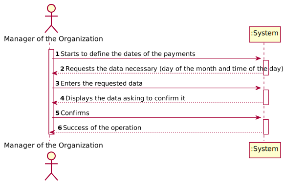
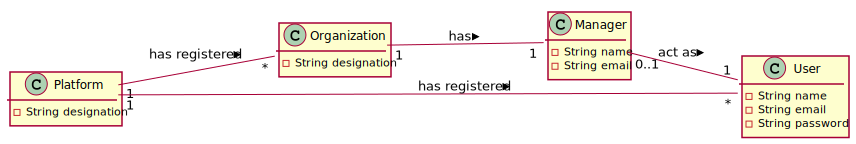
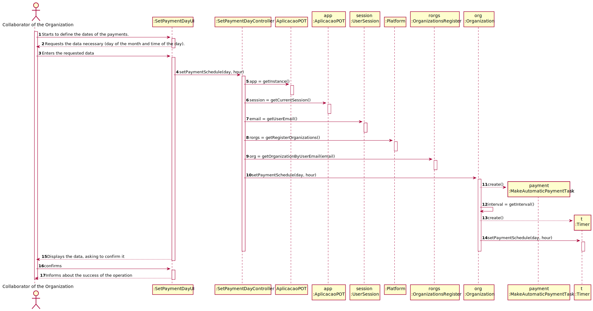
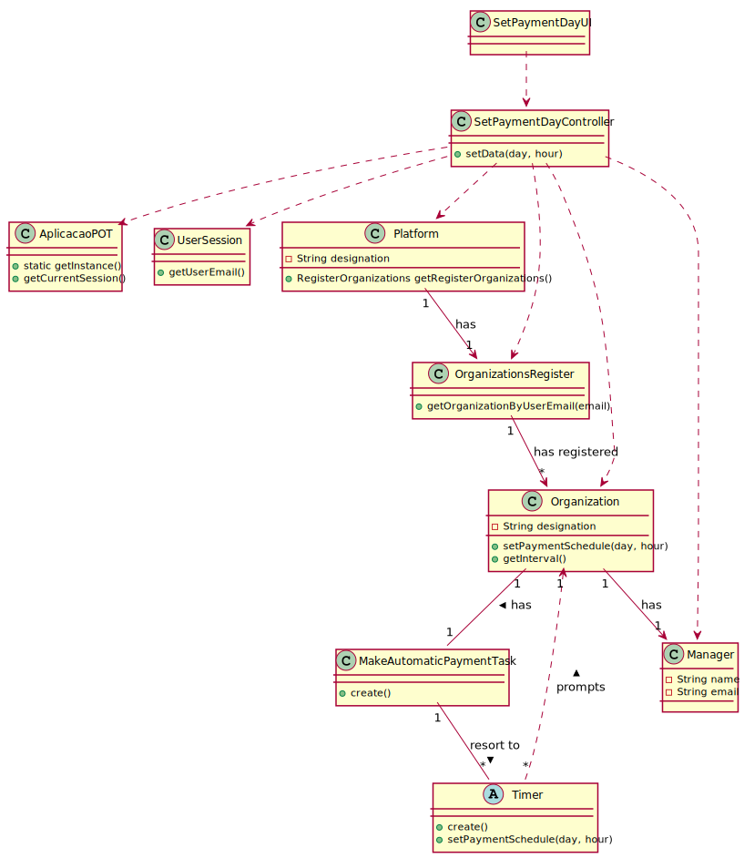

# UC5 - Set Payment Day

## 1. Requirements Engineering

### Brief Format

The manager of the organization **starts** to define the dates of the payments. The system **requests** the data necessary (day of the month and time of the day). The manager of the organization **enters** the requested data. The system **validates** and **displays** the data asking to confirm it. The manager of the organization **confirms**. The system **registers** the data and **informs** the manager of the organization about the success of the operation.

### SSD

### Full Format

#### Main actor

* Manager of the Organization

#### Stakeholders and their Interests

* **Manager of the Organization:** intends to set a date for the payment transactions.
* **Freelancer:** receive money for the task finished by him.
* **T4J:** allow the Manager of the Organization to set a date for the payment transactions.

#### Pre-conditions

* The user is registered as manager of the organization.
* There are payment transactions that have not been paid yet.

#### Post-conditions

* The payment transaction receives a new date of payment.

#### Main success scenario (or basic flow)

1. The manager of the organization **starts** to define the dates of the payments.
2. The system **requests** the data necessary (day of the month and time of the day).
3. The manager of the organization **enters** the requested data.
4. The system **validates** and **displays** the data asking to confirm it.
5. The manager of the organization **confirms**.
6. The system **registers** the data and **informs** the manager of the organization about the success of the operation.

#### Extensions (or alternative flows)

*a. The manager of the organization requests the cancellation of the action.
> The use case ends.

4a. Missing minimum required data.
 >	1. The system informs the manager of the organization which data is missing.
 >	2. The system allows the manager of the organization to enter the missing data (step 3)
 >
	 >	2a. The manager of the organization doesn't change the data. The use case ends.

4b. The system detects the data (or some subset of the data) entered is not right.
 >	1. The system alerts the manager of the organization to the fact.
 >	2. The system allows the manager of the organization to change it (step 3)
 >
	 >	2a. The manager of the Organization doesn't change the data. The use case ends.

#### Special requirements
\-

#### List of Technologies and Data Variations
\-

#### Frequency of Occurrence
\-

#### Questões em aberto

* How often does this use case occurrence?

## 2. OO Analysis

### Excerpt from the Relevant Domain Model for UC

## 3. Design - Use Case Realization

### Rational

|    Main Flow     | Question: What Class ...  |   Answer  | Justification  |
|:----------------|:------------------------- |:----------|:---------------------------- |
|1. The manager of the organization **starts** to define the dates of the payments.|... interacts with the Manager of the Organization?|SetPaymentDayUI|Pure Fabrication|
||...coordinates the UC?|SetPaymentDayController|Controller|
||...knows PaymentTransaction?|PaymentTransactionList|Creator (Rule 1) combined with HC + LC on Organization|
||...knows the user/collaborator of the organization that are using the system?|UserSession|IE: cf. documentation of the user management component|
||...knows which organization the user/collaborator of the organization belongs to?|OrganizationsRegister|IE: Knows all organizations.|
|||Organization|IE: Knows its collaborators|
|||Manager|IE: Knows its data (e.g. email)|
|2. The system **requests** the data necessary (day of the month and time of the day).||||
|3. The manager of the organization **enters** the requested data.|... checks if the data entered is possible?|PaymentTransaction|IE: Instance created in UC4|
|4. The system **validates** and **displays** the data asking to confirm it.|... validates PaymentTransaction's data? (local validation)|PaymentTransaction|IE: Has its own data|
|5. The collaborator of the organization **confirms**.||||
|6. The system **registers** the data and **informs** the manager of the organization about the success of the operation.|...saves the data?|PaymentTransaction|IE: Has its own data|

### Systematization ##

 It follows from the rational that the conceptual classes promoted to software classes are:

 * Platform
 * Organization
 * Manager
 * PaymentTransaction

Other software classes (i.e. Pure Fabrication) identified:

 * SetPaymentDayUI  
 * SetPaymentDayController
 * PaymentTransactionList
 * OrganizationsRegister

Other classes of external systems / components:

* UserSession

###	Diagrama de Sequência

###	Diagrama de Classes

