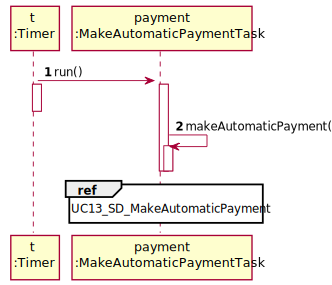

# UC6 - Make Automatic Payment

## 1. Requirements Engineering

### Brief Format

 The automatic payment scheduled is reached. The System makes a bank transfer to the freelancer account, sends him an e-mail with a detailed invoice and saves the organization payment.

### SSD

### Full Format

#### Main actor

N/a

#### Stakeholders and their Interests

* **Freelancer:** intends to receive the payment for the task performed.
* **Organization:** intends to pay freelancers for the tasks performed.
* **T4J:** intends to implement an automatic payment method.

#### Pre-conditions

* The payment must be defined.
* The payment must have a defined schedule, previously defined by the manager.  

#### Post-conditions

* The payment is made by bank transfer to the freelancer account.
* The freelancer receives an invoice on his e-mail, describing the amount to pay for each task and the overall payment value.
* It is created a txt file with all the payment registers, made by all organizations.

#### Main success scenario (or basic flow)

1. The automatic payment schedule is **reached**.
2. The System **makes a bank transfer** to the freelancer account, **sends him an e-mail** with an an invoice **(describing the amount to pay for each task and the overall payment value)** and **saves the organization payment.**

#### Extensions (or alternative flows)

#### Special requirements

* This process requires the Freelancer's IBAN and email.

#### List of Technologies and Data Variations

#### Frequency of Occurrence
* Whenever the payment time is reached, running the process with a defined interval.

#### Unanswered Questions

* Can the automatic process be disabled?
* Is all data mandatory?

## 2. OO Analysis

### Excerpt from the Relevant Domain Model for UC

## 3. Design - Use Case Realization

### Rational

|    Main Flow     | Question: Which Class ...  |   Answer  | Justification  |
|:-----------------|:------------------------- |:----------|:---------------------------- |
|1. The automatic payment schedule is reached.|...creates the schedule?| **Manager** | Creator: On the MD Manager defines the date of payment.  |
| |...has the schedule? | **PaymentTransaction**| IE: PaymentTransaction has its own data. |
| |... coordinates the UC ? | **MakeAutomaticPaymentTask** | Task. |
| |... determines that the time has been reached and triggers the automatic payment process? | **Timer** | Timer is a scheduler. |
|2. The System makes a bank transfer to the freelancer account, sends him an e-mail with an an invoice (describing the amount to pay for each task and the overall payment value) and saves the organization payment. |... knows OrganizationsRegister? | **Platform**  | IE: Platform contains/ aggregates OrganizationsRegister(according to HC + LC Pattern on Platform). |
| | ... knows the Organization ? | **OrganizationsRegister** | IE: OrganizationsRegister contains/ aggregates Organization(according to HC + LC Pattern on RegisterOrganizations).|
| | ... knows the FreelancerRegister? |**Platform** | IE: Platform contains/ aggregates FreelancerRegister(according to HC + LC Pattern on Platform).
| | ... knows the Freelancer? | **FreelancerRegister** | IE: FreelancerRegister contains/ aggregates Freelancer(according to HC + LC Pattern on FreelancerRegister).|
| | ... knows the data of the Freelancer? | **Freelancer** |IE: Freelancer has its own data.|
| | ... has the payment transaction? | **Organization** | IE: On the MD Organization has the payment transaction.|
| | | **PaymentTransactionList** | IE: Organization contains/ aggregates PaymentTransactionList(according to HC + LC Pattern on Organization).|
| | ... does the bank transfer?| **BankTransferAlgorithm** | Protected Variation.|
| | ... sends the email? | **ExternalEmailSenderAlgorithm** | Protected Variation.|
| | ... registers the information on the file? | **PaymentTransaction**| IE: Has the necessary information.|
### Systematization 

 It follows from the rational that the conceptual classes promoted to software classes are:
 
 * Platform
 * Organization
 * Manager
 * Freelancer
 * PaymentTransaction
 * BankTransferAlgorithm
 * ExternalEmailSenderAlgorithm
 
 Other software classes (i.e. Pure Fabrication) identified:
 
 * MakeAutomaticPaymentTask
 * OrganizationsRegister
 * FreelancerRegister
 * PaymentTransactionList
 
 Other classes of external systems / components:
 
 * Timer
 
 ### Diagrama de Sequência
 
 
 
 
 
 ### Diagrama de Classes
 
 
 