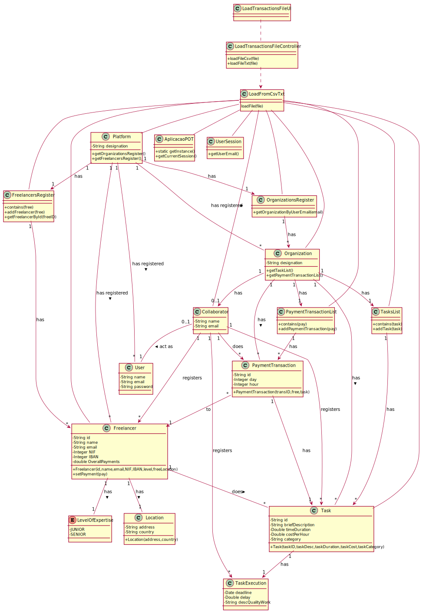

# UC6 - Make Automatic Payment

## 1. Requirements Engineering

### Brief Format

The collaborator **starts** the **loading file** process. The system **asks** the collaborator for the **file name**. The collaborator **enters the file name**. The system **finds the file**, **saves its content** and **informs** the collaborator of the success of the operation.

### SSD

### Full Format

#### Main actor

* Collaborator of the Organization

#### Stakeholders and their Interests

* **Collaborator:** intends to load a file with a register of historical transactions. 
* **Organization:** intends to see/use the content of the historical transactions.
* **T4J:** intends to load a file with historical transactions into the system.

#### Pre-conditions

It has to exist a file with the name introduced by the collaborator.

#### Post-conditions

A file is read and its information is recorded in the system.

#### Main success scenario (or basic flow)

1. The collaborator **starts** the **loading file** process.
2. The system **asks** the collaborator for the **file name**.
3. The collaborator **enters the file name**.
4. The system **finds the file**, **saves its content** and **informs** the collaborator of the success of the operation.

#### Extensions (or alternative flows)

*a. The Collaborator requests the cancellation of the loading process.

> The use case ends.

3a. The collaborator leaves the search box empty.
 >	1. The system informs the collaborator which data is missing.
 >	2. The system allows the Collaborator of the Organization to enter the missing data (step 2)
 >
	 >	2a. The Collaborator doesn't change the data. The use case ends.

3b. The collaborator introduces a non-existing file name.
 >	1. The system alerts the Collaborator to the fact.
 >	2. The system allows the Collaborator of the Organization to change it (step 2)
 >
	 >	2a. The Collaborator of the Organization doesn't change it. The use case ends.

#### Special requirements

* It is required a File with the historical transactions.

#### List of Technologies and Data Variations

#### Frequency of Occurrence

* Whenever collaborator wants to (the  collaborator can load an unlimited number of such files into the payments application).

#### Unanswered Questions
 

## 2. OO Analysis

### Excerpt from the Relevant Domain Model for UC

## 3. Design - Use Case Realization

### Rational

|    Main Flow     | Question: Which Class ...  |   Answer  | Justification  |
|:-----------------|:------------------------- |:----------|:---------------------------- |
|1. The collaborator **starts** the **loading file** process.| ... interacts with the Collaborator? | LoadTransactionsFileUI | Pure Fabrication.|
| | ...coordinates the UC? | LoadTransactionsFileController | Controller
| | ... creates instances of LoadPaymentsFile? | FilesRegister| By the application of Creator (Rule 1) it would be the Platform, but by applying HC + LC to the Platform, this delegates that responsibility to the FilesRegister.|
|2. The system **asks** the collaborator for the **file name**.||||
|3. The collaborator **enters the file name**.| ...creates the Task? | Collaborator | IE: In the MD Collaborator creates Task.|
| | ...creates a Freelancer? | Collaborator | IE: In the MD Collaborator creates Freelancer.|
| | ...creates a PaymentTransaction?| Collaborator|IE: In the MD Collaborator creates PaymentTransaction.|
|4. The system **finds the file**, **saves its content** and **informs** the collaborator of the success of the operation.| ... validates the Task data(local validation) | Task|  IE: Task has its own data.|
| | ... validates the Task data(global validation)? | TaskList |  IE: In the MD, the Organization has Task. By applying HC+LC pattern, this delegates the TaskList.|
| | ... validates the TaskExecution dada? | Task | IE: In the MD Task has TaskExecution.|
| | ... validates the Freelancer data(local validation)? | Freelancer |  IE: Freelancer has its own data|
| | ... validates the Freelancer data(global validation)? | FreelancersRegister |  IE: In the MD, the Organization has Freelancer. By applying HC+LC pattern, this delegates the FreelancerRegister.|
| | ... validates the PaymentTransaction data(local validation)? | PaymentTransaction|  IE: PaymentTransaction has its own data|
| | ... validates the PaymentTransaction data(global validation)? | PaymentTransactionsList |  IE: In the MD, the Organization has PaymentTransaction. By applying HC+LC pattern, this delegates the PaymentTransactionsList.|
| | ... notifies the Collaborator about the success of the operation? | LoadTransactionsFileUI ||

### Systematization 

 It follows from the rational that the conceptual classes promoted to software classes are:
 
 * Platform
 * Collaborator
 * Task
 * Freelancer
 * PaymentTransaction
 * LoadPaymentsFile
 
 Other software classes (i.e. Pure Fabrication) identified:
 
 * LoadTransactionsFileUI 
 * LoadTransactionsFileController
 * TaskList
 * FreelancersRegister
 * PaymentTransactionsList
 * FilesRegister
 
 Other classes of external systems / components:
 
 
 ### Diagrama de Sequência
 
 
 
 
 
 ### Diagrama de Classes
 
 