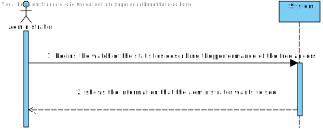
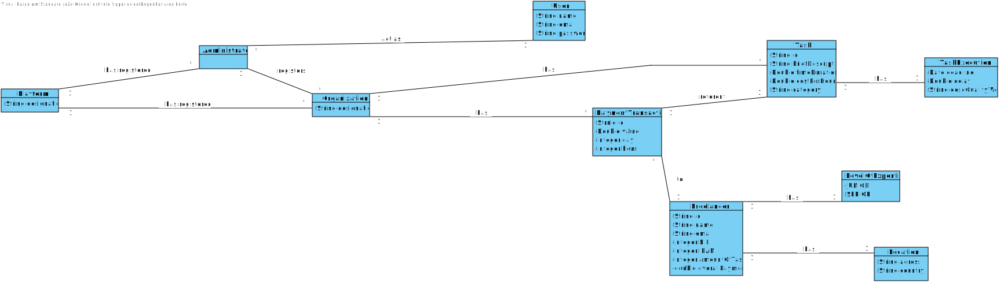
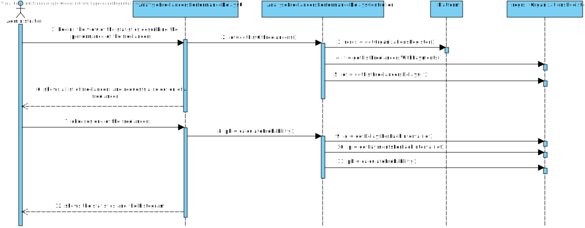
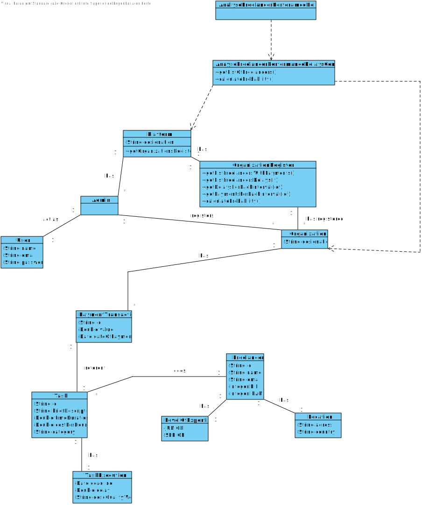

# UC8 - Freelancers Performance Statistics

## 1. Requirements Engineering

### Brief Format

The administrator begins the view of the statistics describing the performance of the freelancers. The system shows the information that the administrator wants to see.

### SSD

### Full Format

#### Main Actor

Administrator

#### Stakeholders and their Interests

* **Administrator:** wants to see the statistics realted to the performance of the freelancers.
* **T4J:** wants their platform to be able to show the statistics of the freelancers.
* **Freelancer:** wants to get their statistics shown.

#### Pre-conditions
There needs to be data to be used to make the statistics.

#### Post-conditions
The data related to the freelancers' statistics is saved in the system.

#### Main Sucess Scenario (or basic flow)

1. The administrator begins the view of the statistics describing the performance of the freelancers.
2. The system shows a list of freelancers and requests a selection of a freelancer.
3. The administrator chooses one.
4. The system shows the statistics and the histogram.

#### Extensions (or alternative flows)
a. The administrator requests the cancellation of the analysis.
> The use case ends.

2a. There are no freelancers to choose.
> The use case ends.

4a. There are no statistics to analyse.
> The use case ends.

#### Special Requirements

\-

#### List of Technologies and Data variations
\-

#### Frequency of Occurrence

\-

#### Unanswered Questions

What is the frequency of occurrence of this use case ?

## 2.OO Analysis

### Excerpt of the model Relevant Domain Model for UC

## 3. Design - Use Case Realization

### Rational

| Main flow | Question: Wich class ... | Answer  | Justification  |
|:--------------  |:---------------------- |:----------|:---------------------------- |
| The administrator begins the view of the statistics describing the performance of the freelancers.		 |...interacts with the administrator?							 | AnalyseFreelancersPerformanceDelaysUI             |Pure Fabrication   |
||...coordenates de UC?|AnalyseFreelancersPerformanceDelaysController|Controller|
|The system shows a list of freelancers and request the selection of one freelancer  |...will have the list of all freelancers?	 |OrganizationsRegister| IE: knows all the organizations and they have all the freelancers.      |
||...knows OrganizationsRegister?|Platform|IE: Platform has OrganizationsRegister|
||...calculates the statistics of the freelancers? |OrganizationsRegister|IE: knows all the data related to the freelancers. |
|The administrator chooses one of the freelancers. ||||
| The system shows the statistics and the histogram. |... calculates the math related to the histogram?	|OrganizationsRegister  |IE: knows all the data related to the freelancers.                              |              

### Sistematization ##

 It follows from the rational that the conceptual classes promoted to software classes are:

 * Platform

Other software classes (i.e. Pure Fabrication) identified:  

 * AnalyseFreelancersPerformanceDelaysUI  
 * AnalyseFreelancersPerformanceDelaysController
 * OrganizationsRegister

###	Sequence Diagram

###	Class Diagram

