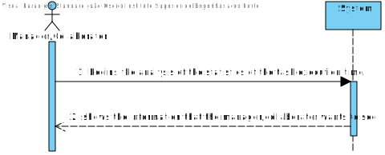
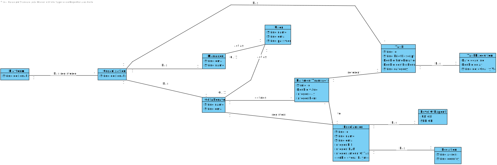
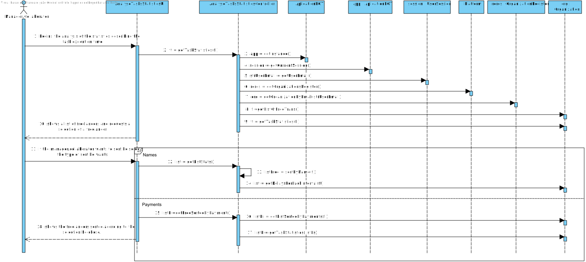
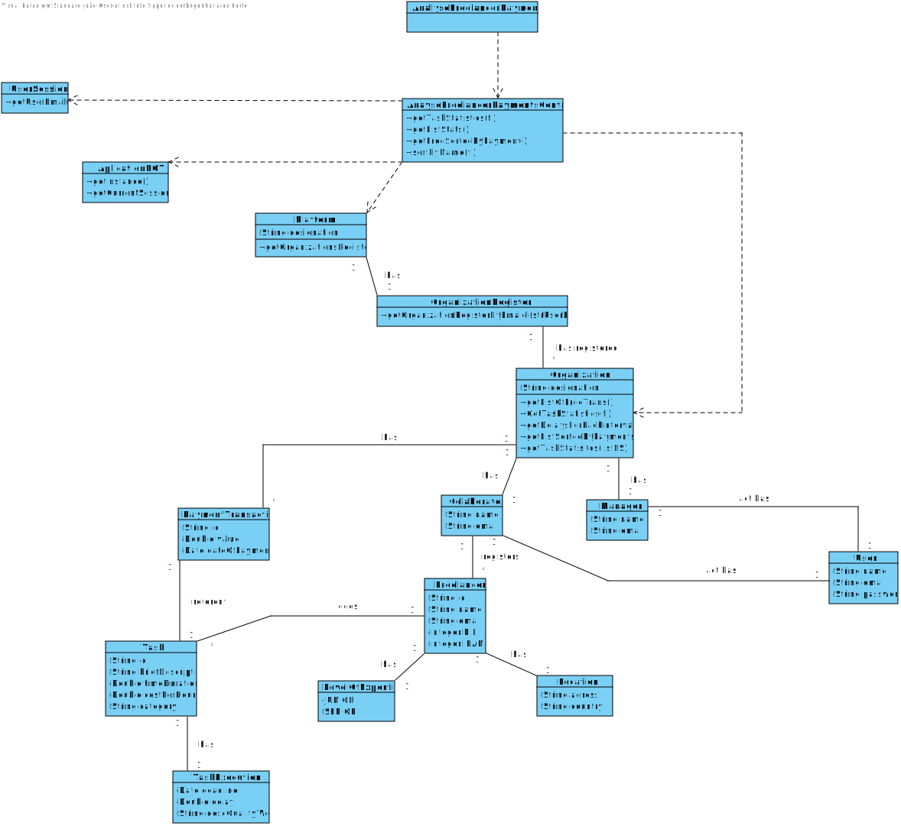

# UC9 - Task Execution Time Statistics

## 1. Requirements Engineering

### Brief Format

The manager/collaborator begins the analysis of the statistics of the task execution time. The system shows the information that the manager/collaborator wants to see.

### SSD

### Full Format

#### Main Actor

Manager/Collaborator

#### Stakeholders and their Interests

* **Manager/Collaborator:** wants to see the statistics realted to the task execution time.
* **T4J:** wants their platform to be able to show the statistics of the task execution time.
* **Freelancer:** wants to get their statistics shown.

#### Pre-conditions
There needs to be data to be used to make the statistics.

#### Post-conditions
The data related to the task' statistics is saved in the system.

#### Main Sucess Scenario (or basic flow)

1. The manager/collaborator begins the analysis of the statistics describing the task execution time.
2. The system shows a list of freelancers.
3. If the manager/collaborator wants to sort, he selects the type of sort he wants.
4. The system shows the freelancers sorted acording to the selection he chose and their statistics.

#### Extensions (or alternative flows)
a. The manager/collaborator requests the cancellation of the analysis.
> The use case ends.

3a. The Manager/Collaborator doesn't want to sort the freelancers.
> The use case ends.

4a. There are no statistics to analyse.
> The use case ends.

#### Special Requirements

\-

#### List of Technologies and Data variations
\-

#### Frequency of Occurrence

\-

#### Unanswered Questions

What is the frequency of occurrence of this use case ?

## 2.OO Analysis

### Excerpt of the model Relevant Domain Model for UC

## 3. Design - Use Case Realization

### Rational

| Main flow | Question: Wich class ... | Answer  | Justification  |
|:--------------  |:---------------------- |:----------|:---------------------------- |
| The manager/collaborator begins the analysis of the statistics describing the task execution time.		 |...interacts with the administrator?							 | AnalyseFreelancerPaymentsUI            |Pure Fabrication   |
||...coordenates de UC?|AnalyseFreelancerPaymentsController|Controller|
||...knows the user using the system?|UserSession|IE:cf. user management component documentation.|
||...knows wich organization the user belongs to?|OrganizationRegister|IE:knows all organizations.|
|||Organization|IE:knows his mangers/collaborators.|
|||Collaborator|IE: knows its data.|
|||Manager|IE: knows its data.|
|The system shows a list of freelancers.  |...will have the list of freelancers?	 |Organization| IE: The class will have a method that returns a list of freelancers who received a payment from the organization.      |
||...calculates the statistics of the freelancers? |Organization|IE: knows all the data related to the organization. |
|If the manager/collaborator wants to sort, he selects the type of sort he wants.  ||||
| The system shows the freelancers sorted acording to the selection he chose and their statistics. ||  |     |              

### Sistematization ##

 It follows from the rational that the conceptual classes promoted to software classes are:

 * Platform
 * Organization

Other software classes (i.e. Pure Fabrication) identified:  

 * AnalyseFreelancerPaymentsUI   
 * AnalyseFreelancerPaymentsController
 * OrganizationRegister

###	Sequence Diagram

###	Class Diagram

